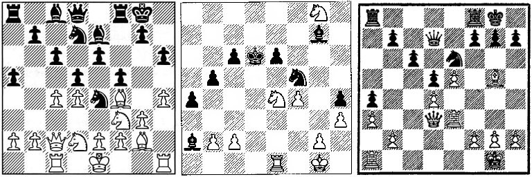

**Chessputzer** recognizes chess positions. Use the [web interface](https://www.ocf.berkeley.edu/~abhishek/putz/). 

For best results, include the border of the chessboard and crop close to it. If parts of the diagram are blurry and harder to decipher, the algorithm makes the best guess based on other pieces on the board. 

**Note**: the program is intended for fonts that usually appear in print. Images created by chess software might not work. 

Please let me know if you have examples of books and images that cause problems.

Have fun!

----

**Chessputzer** was inspired by [Fenbot](https://github.com/Elucidation/tensorflow_chessbot) but the internals are quite different. It is designed for scanned images using popular fonts, with plenty  of noise and artifacts.  Our aim is to do less, but tolerate more. 

**How it works**

1. [Cropping and Cutting](Splitting up the board.ipynb) where we detect the boundary of the chessboard and split it up into 64 squares.

2. [Filtering and Matching]("./Matching and Filtering.ipynb") where we rediscover the ancient technique of template matching. And spend many happy hours removing the stripes from the dark squares. 

3. *Error correction* where we admit that the board probably does not have six knights on it, and make the best guess.

4. *Deep Learning* where we turn to the twenty-first century [alchemists](<https://youtu.be/Qi1Yry33TQE?t=745>).

